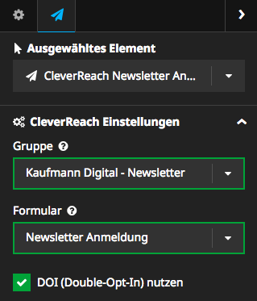

KaufmannDigital.CleverReach
===========================

An easy-to-use package, that integrates [CleverReach](https://www.cleverreach.com)® into your [Neos](https://www.neos.io) site.

Installation
------------

The easiest way to install is running this command:
```bash
composer require kaufmanndigital/cleverreach
```

After successful installation, configure your CleverReach® credentials in the `Settings.yaml`:

```yaml
KaufmannDigital:
  CleverReach:
    credentials:
      clientId: '' #CleverReach customer number
      login: '' #CleverReach username/email
      password: '' #CleverReach password
```
Now please make sure that your user has API access: [Further Reading](https://support.cleverreach.de/hc/de/articles/115001544369-Der-Benutzer-hat-keinen-API-Zugriff)  

**Note:** Sadly CleverReach® does not supply a static API-Key for your account. Thats why the package needs your credentials to get and renew the Token. Your credentials will only be transferd via HTTPS!

**Optional:** If you want to use Ajax submitting your forms, please load the shipped JavaScript (jQuery needed) using `<script src="{f:uri.resource(path: 'JavaScript/Main.js', package: 'KaufmannDigital.CleverReach')}"></script>` inside your template or create your own Ajax-action.  

_Congratulations, you are ready to use **KaufmannDigital.CleverReach** in your Neos installation._


Setting up the Registration Form 
--------------------------------

In order to add a Registration Form to your Website, you have to **create a group** (and a form, if your want to use [DOI](https://www.cleverreach.com/de/funktionen/empfaenger-verwalten/doi-anmeldeformulare/))  
Currently these steps can not be done by this Package (see Planned Features). So please go to your [CleverReach Login](https://www.cleverreach.com/de/login/) and follow the instructions there.

When you finished, login into your Neos and navigate to the page, you want to place the registration form on.  
Now select the "CleverReach Registration Form" NodeType from the list and insert it where you want.

Afterwards you can select the group, users would be added to and form which should be used for Double-Opt-In (if activated):  


You are mostly finished. Just give it a try: Register your E-Mail using the Neos frontend and check at CleverReach's customer area.


Additional Fields
-----------------

CleverReach® supports additional fields to store more information about the subscriber. [Take a look here](https://support.cleverreach.de/hc/de/articles/202372851-Nutzung-eigener-Datenfelder-in-Empf%C3%A4ngerlisten)  
These fields are also supported by this package. To submit data to this fields, you have to do a bit of customizing:

1. Create the additional fields at CleverReach®. [Described here](https://support.cleverreach.de/hc/de/articles/202372851-Nutzung-eigener-Datenfelder-in-Empf%C3%A4ngerlisten)
2. Override the template of NodeType [Explained in Documentation](http://flowframework.readthedocs.io/en/stable/TheDefinitiveGuide/PartIII/ModelViewController.html#configuring-views-through-views-yaml)
3. Add your custom fields as input field to your customized template:
    ```html
    <f:form.input name="receiverData[attributes]" />
    ```
    or as hidden field: 
    ```html
    <f:form.hidden name="receiverData[attributes]" value="My Value"/>
    ```
    
    For **global additional fields** just replace `attributes` with `global_attributes`
    
    
Orders
------
CleverReach® also allows you to supply order information with the new subscriber.  
To do that you have to override the template as explained above in step 2 of **Additional Fields**
Then you can add something like that to the form: 
```html
<f:form.hidden name="receiverData[orders][0][order_id]" value="1234" />
<f:form.hidden name="receiverData[orders][0][product_id]" value="5678" />
<f:form.hidden name="receiverData[orders][0][product]" value="Produktname" />
<f:form.hidden name="receiverData[orders][0][quantity]" value="1337" />
<f:form.hidden name="receiverData[orders][0][price]" value="19.95" />
<f:form.hidden name="receiverData[orders][0][currency]" value="EUR" />
```


FAQ
---

* I get an error `CleverReach authentication failed. Credentials correct?`
  * Make sure the credentials you have configured in `Settings.yaml` are correct. To be sure, copy the credentials and try to log into CleverReach's website with it.


Known Bugs
----------
Known Bugs are submitted as issue. Please have a look to it, before you supply a Bug you found.  
You did a Bugfix? Great! Please submit it as PR to share it with other users. 

Planned Features
----------------
Planned functions are also created as issues and marked as such.  
You have another idea? Or would you like to help with the implementation? Gladly! Jimply create new issues or PRs.

Maintainer
----------
This package is maintained by [Kaufmann Digital](https://www.kaufmann.digital).  
Feel free to send us your questions or requests to [support@kaufmann.digital](mailto:support@kaufmann.digital)

License
-------

Licensed under GPLv3+, see [LICENSE](LICENSE)
